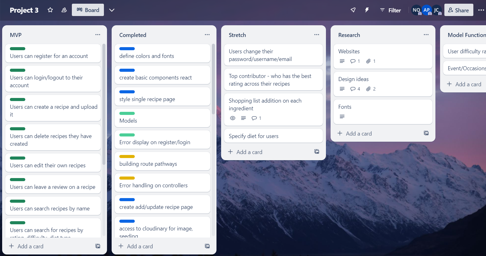
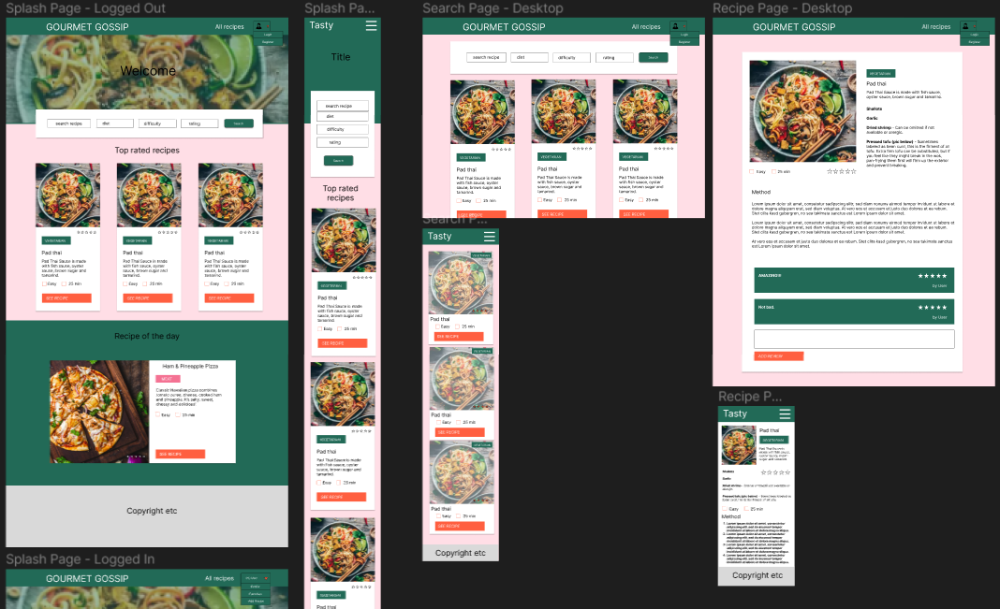
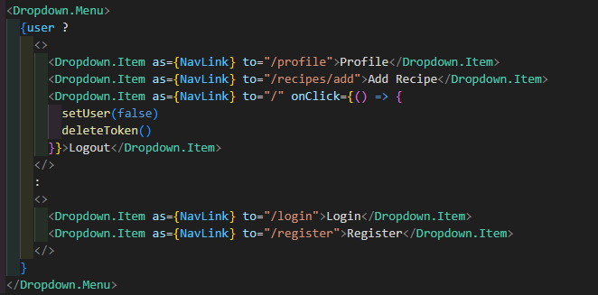
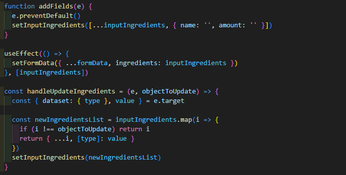
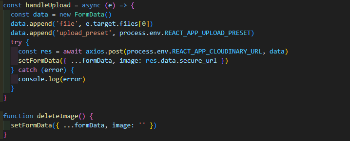
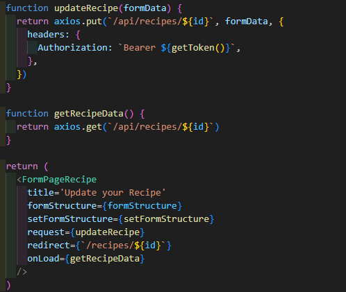
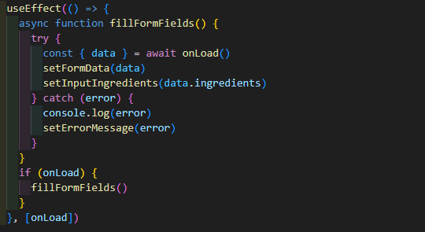
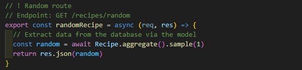
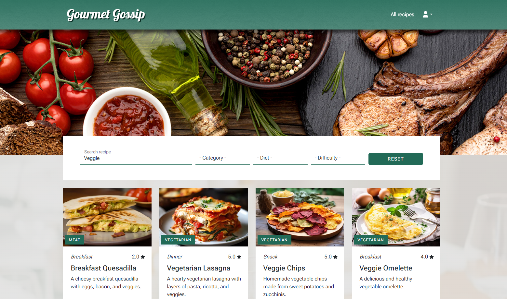
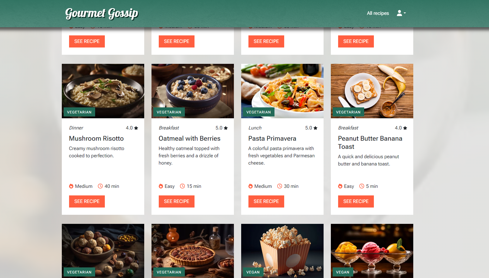

# Gourmet Gossip

## Description

Gourmet Gossip is a recipe sharing website where users can view, create, edit and delete recipes and leave reviews for recipes created by other users.

Users can easily search and filter their favorite recipes by different categories and get detailed information on the single recipe pages. It is possible to create accounts and view a personal profile page.

## Deployment link

https://gourmetgossip-c203cdaf4c83.herokuapp.com/ 

## Timeframe & Working Team

We were given 8 days to create our first full stack application as a group of three members. Alex, James and I collaborated to build an application based on a React frontend, Node backend, a fully functional Express API with GET, POST, PUT and DELETE routes and also custom authentication to enable login and register.
Collaborator: parkeralexjm, jchesher92

## Technologies Used

### Frontend

- React
- Bootstrap
- JavaScript
- Sass

### Backend

- Node.js
- Express
- MongoDB
- Mongoose

### Version control

- Git
- Github

### Others

- Figma
- Trello
- Google Fonts
- Font Awesome

## Brief

- Build a full stack application by making your own backend and your own frontend
- Use an Express API to serve your data from a Mongo database
- Consume your API with a separate frontend built with React
- Be a complete product which means multiple relationships and CRUD functionality for at least a couple of models
- Implement thoughtful user stories/wireframes that are significant to know which features are core MVP and which you can cut
- Have a visually impressive design to kick your portfolio up a notch
- Be deployed online so it's publicly accessible

## Planning

We started our project by understanding the requirements and researching for a suitable topic and design ideas for the layout. With Figma we created a detailed wireframe to visualize the structure and features of our application. We defined routes and models and a clear goal of our MVP. The project management tool Trello supported us with managing our workflow and task tracking.

## Build/Code Process

### Day 1

Day 1 was our planning day. We finalized our wireframe and talked through possible use cases. On Trello we defined detailed tasks to identify which features we have to work on.

Regarding our individual strengths we decided for James to focus on the backend, me to focus on the frontend and Alex would float between picking up features as needed. Thanks to our detailed task planning we were able to work quite independently.

### Day 2

I started the day with setting up React and creating all paths and components needed. I installed React Bootstrap and Sass and defined global accessible colors and fonts.

The first feature I implemented was the header section including logo, navigation bar and a dropdown menu which changes depending on if the user is logged in or logged out.

While James and Alex were working on the backend creating models, routes and controllers I helped seeding the database using ChatGPT to have some content to work with whilst building the frontend.

### Day 3

On day 3 I focused on implementing the search bar on the Home and All Recipes page. It allows users to search recipes by name and description and additionally filter them by category, diet and difficulty. The filtered recipes are displayed instantly as the user makes changes to find suitable recipes faster.
The others were working on the login and register form considering authentication routes and validating passwords as well as storing the password as a hash using bcrypt.

### Day 4 and 5

The biggest challenge I faced in this project was creating a form which allows users to create and edit their own recipes. I decided to build a dynamic form which makes it possible for the user to add and remove fields of the form dynamically depending on the amount of ingredients needed for a specific recipe. The difficulty was in transmitting the requested data in the correct structure as an dynamically changing array of objects.
For storing uploaded images I used cloudinary as a cloud-based media management platform.

When editing an existing recipe the form is prefilled with all the recipe data and can easily be changed and saved. This feature is only available for users who created the recipe.
On a shared screen we worked together on displaying accurate error messages when users are submitting a form incorrectly.

### Day 6

On day 6 my attention was on the single recipe pages. I spent the morning implementing some styles to make the desktop, tablet and mobile version display nicely. I have also added icons to make it possible to edit and delete a recipe. Reusing design elements and icons throughout the whole project makes the application uniform and really user-friendly.
I also added a feature to write a review on a recipe created by another user. The possibility to select a range makes the star rating easy. Own reviews can be deleted per click.

### Day 7

In order to display a recipe of the day on the start page I created a route in the backend to request a random recipe from the database. I used the day to style this and other elements. I focused on improving the mobile version of the whole application and also reseeded the database to have a good amount of content before deploying the website.

### Day 8

On the last day we were testing all features and case scenarios to find possible bugs. We made a list of the last improvements we want to work on which were mostly about the responsiveness and visual appearance of the website. I have also implemented a Spinner and a Header image.

## Challenges

A technical challenge I had to face during this project was the deployment of the application. Using a windows computer makes some installations difficult like the one of heroku. Understanding error messages and trying different approaches to get it installed was a big challenge.

## Wins

A personal win from this project was the implementation of the dynamic form to add and edit a recipe. This really helped me to identify better where exactly a problem starts and I improved my problem-solving skills a lot.

The visual design of the project is another success for me. Consistency with colors and images, the usage of icons and a well-working mobile version makes the application attractive and user friendly.

## Key Learnings/Takeaways

A big takeaway for me from this project is working with Git. I learned a lot about fixing merge conflicts and about the importance of using branches to work on specific features.
And after forgetting to add a gitignore file in the beginning and releasing our environment variables online, this was a big learning as well.

Apart from that I became more comfortable in using project management tools. I understood these are essential to plan steps in a smart order and guide a team through a project regarding the given deadline.
With gaining more experience in developing I can also estimate better how long it takes to implement certain features.

Using new features which React and Bootstrap provide has strengthened my ability to read and understand documentations and teach myself new skills. 

## Bugs

No bugs known

## Future Improvements

- View user profiles
- Allow users to change their username, email and password
- Add a diet choice for users to sort by preferences
- Add a shopping list function for users to add ingredients to their list for later
